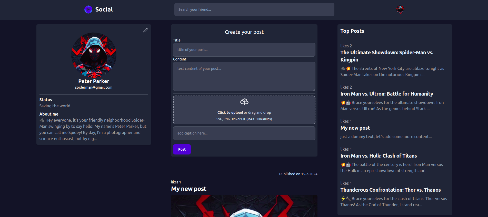

# Social media application


This is a social networking application which is based on MVC architecture. It is based on django framework. It gives the utility to create new user, create new posts, make friend request and make new friends.

## Documentation

### Prerequisites
1. Python
2. Django
3. Tailwindcss
4. nodejs
5. Flowbite

### How to start
```bash
# cloning the project
git clone git@github.com:Shobhit-Mishra-02/Readme-backend.git
cd Social-media-app


# installing python packages
pip install -r requirements.txt

# creating database
python manage.py makemigrations
python mange.py migrate

# starting the server
python manage.py runserver
```

- Default database is mysql lite, for adding any other database support checkout [django docs](https://docs.djangoproject.com/en/5.0/intro/tutorial02/)
